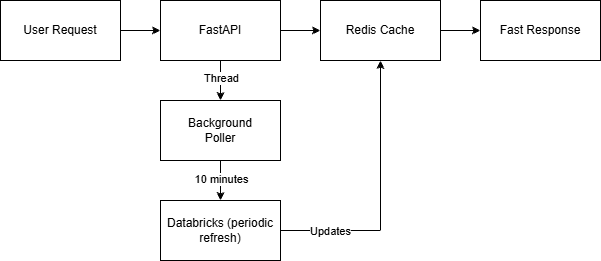

# TBP-HOLMES Backend

A FastAPI-based backend service that provides cached access to Databricks analytics data through a Redis-backed polling architecture.

## Purpose

This backend API serves as a high-performance data layer between the HOLMES frontend application and Databricks. It exposes RESTful endpoints for querying analytical data across multiple services (Sherlock, Watson, Enola, Mycroft).

## Motivation

The primary driver for creating this dedicated backend was to **mitigate slow and over-utilized Databricks connections**. By polling Databricks tables periodically from a single backend service and distributing cached results from Redis, end-user load times are drastically reduced—**in some cases by 10x**.

### Key Benefits
- Reduced Databricks query load
- Significantly faster response times for end users
- Centralized query management
- Single point of authentication and authorization

## Architecture



## Project Structure

```
backend/
├── main.py                      # FastAPI application entry point
├── internal/
│   ├── auth.py                  # Azure AD OIDC authentication
│   ├── databricks_service.py    # Databricks connection & query execution
│   └── poller.py                # Background scheduler for polling Databricks
├── routers/
│   ├── sherlock/                # Sherlock service endpoints
│   ├── watson/                  # Watson service endpoints
│   ├── enola/                   # Enola service endpoints
│   └── mycroft/                 # Mycroft service endpoints
└── queries/
    ├── sherlock/                # SQL queries for Sherlock
    ├── watson/                  # SQL queries for Watson
    ├── enola/                   # SQL queries for Enola
    └── mycroft/                 # SQL queries for Mycroft
```

## Key Components

- **Authentication**: Azure AD OIDC token verification with group-based authorization
- **Poller**: Background scheduler that refreshes Redis cache at configurable intervals
- **Databricks Service**: Manages connections and query execution against Databricks
- **Routers**: Modular API endpoints organized by business service
- **Redis Cache**: Stores query results as JSON for fast retrieval

## Configuration

Required environment variables:
- `DATABRICKS_SERVER_HOSTNAME`
- `DATABRICKS_HTTP_PATH`
- `DATABRICKS_TOKEN`
- `AZURE_TENANT_ID`
- `AZURE_CLIENT_ID`
- `POLL_INTERVAL_SECONDS` (default: 600)

## Running

The command below assumes you are adhering to the suggested development environment from the parent README.md, whereby you are running a devcontainer.

```bash
cd backend
python -m uvicorn main:app --reload --host 0.0.0.0 --port 8000
```
